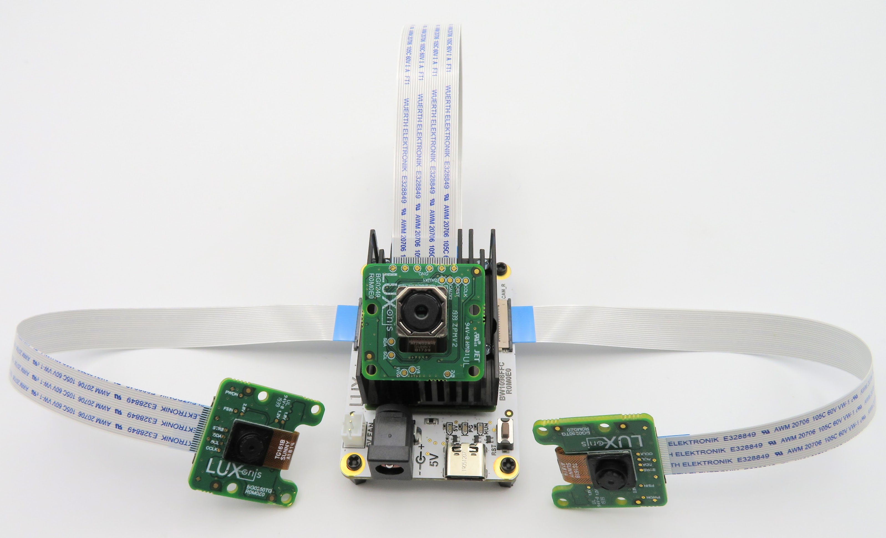
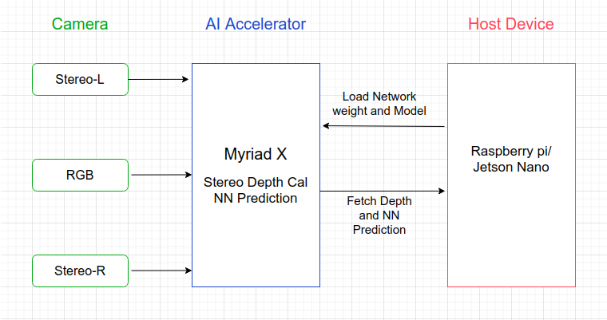

= deepEye - A POC project for OpenCV Spatial AI Competition
:idprefix:
:idseparator: -
:sectanchors:
:sectlinks:
:sectnumlevels: 6
:sectnums:
:toc: macro
:toclevels: 6
:toc-title: Table of Contents

toc::[]

== Introduction
A POC project for OpenCV Spatial AI Competition and we are trying build an advanced assist system for the specially-abled people to perceive the environment in a better way and would provide seamless, reliable navigation for them at a low cost so that anyone can leverage the benefits of computer
vision.

We are building a software stack on DepthAI Modular Camera[BW1098FFC] from Luxonis.



== Installation
=== DepthAI
```bash
git clone https://github.com/luxonis/depthai-python.git
cd depthai-python
git submodule update --init --recursive
mkdir -p ~/depthai_v1
python3 -m venv ~/depthai_v1
python3 -m pip install -U pip
python3 setup.py develop

# Check the Installation
python3 -c "import depthai"
```

=== Camera Calibration
==== BW1098FFC Calibration configuration
```json
{
    "board_config":
    {
        "name": "BW1098FFC",
        "revision": "R0M0E0",
        "swap_left_and_right_cameras": true,
        "left_fov_deg": 71.86,
        "rgb_fov_deg": 68.7938,
        "left_to_right_distance_cm": 5.0,
        "left_to_rgb_distance_cm": 2.5
    }
}
```
```bash
mkdir -p ~/depthai/ && pushd ~/depthai/
git clone https://github.com/luxonis/depthai.git
popd
cp calibration/config/BW1098FFC.json depthAI/depthai/resources/boards/
pushd ~/depthai/
python3 calibrate.py -s 2 -brd BW1098FFC -ih
```
=== ROS

We use ROS framework multiprocess communication.
```bash
sudo sh -c 'echo "deb http://packages.ros.org/ros/ubuntu $(lsb_release -sc) main" > /etc/apt/sources.list.d/ros-latest.list'
sudo apt-key adv --keyserver 'hkp://keyserver.ubuntu.com:80' --recv-key C1CF6E31E6BADE8868B172B4F42ED6FBAB17C654

sudo apt update

sudo apt install -y ros-melodic-ros-base

# Install inside virtual env
python3 -m pip install -U rosdep
rosdep init

rosdep update

```
=== Other dep
```bash
python3 -m pip install -r requirements.txt
```

== Software stack 


== Usage
```bash
# To run a depthai detection, colliusion_avoidance
python3 app.py

# Speech
source /opt/ros/melodic/setup.zsh #zsh
        (or)
source /opt/ros/melodic/setup.zsh #bash 
roscore &

python3 txt2speech.py
```

=== Hardware Information
We plan use the DepthAI USB3 Modular Cameras[BW1098FFC] for POC. We are using RPI and Jeston. The AI/vision processing is done on the depthAI based on Myriad X Arch.


image:images/BW1098FFC_R0M0E0_diag.png[depthAI]

*Key Features of the device:

* 2 BG0250TG mono camera module interfaces
* 1 BG0249 RGB camera module interface
* 5V power input via barrel jack
* USB 3.1 Gen 1 Type-C
* Pads for DepthAI SoM 1.8V SPI
* Pads for DepthAI SoM 3.3V SDIO
* Pads for DepthAI SoM 1.8V Aux Signals (I2C, UART, GPIO)
* 5V Fan/Aux header
* Pads for DepthAI SoM aux signals
* Design files produced with Altium Designer 20

== Experimental work

== Reference
link:https://luxonis.com/depthai[DepthaAI Home Page]

link:https://github.com/luxonis[depthaAI core development]

link:https://github.com/openvinotoolkit/openvino[OpenVino toolkit development]
link:https://github.com/luxonis/depthai-hardware/tree/master/BW1098FFC_DepthAI_USB3[BW1098FFC_DepthAI_USB3 HW]
