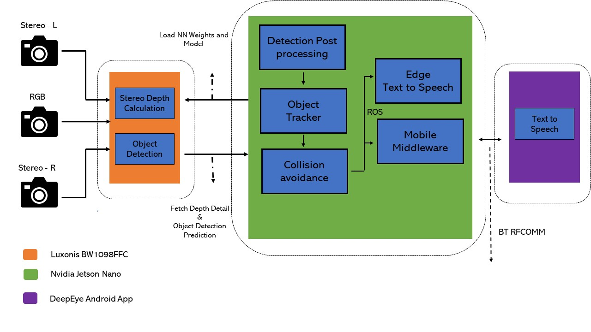

# deepEye - The third eye for Visually Impaired People

[OpenCV](https://opencv.org/) announced its first Spatial AI Competition sponsored by Intel. As we know, OpenCV is a <b>famous open-source computer vision library.</b> They called for participants to solve real-world problems by using <b>[OAK-D](https://www.kickstarter.com/projects/opencv/opencv-ai-kit) (OpenCV AI Kit with Depth)</b> module. The OAK-D module has built-in <b>Stereo cameras along with an RGB camera.</b> It also has powerful <b>visual processing unit (Myriad X from Intel) to enable deep neural network inferences on board.</b>

We decided to submit a project proposal for this competition back in July. Our group’s proposal was selected (among 32 out of 235). 

So, we propose to build <b>an advanced assist system for the Visually Impaired People to perceive the environment in a better way and would provide seamless, reliable navigation for them at a low cost so that anyone can leverage the benefits of computer vision.</b>

## Demo Videos

| 👉 [deepEye Demo](https://www.youtube.com/watch?v=llE8l1IWpYA&feature=youtu.be) |
| ------------------------------------------------------------ |
| [](https://www.youtube.com/watch?v=llE8l1IWpYA&feature=youtu.be) |

## Table of content

- [deepEye - The third eye for Visually Impaired People](#deepEye-the-third-eye-for-visually-impaired-people)
  - [Demo Videos](#demo-videos)
  - [Table of content](#table-of-content)
  - [🎬 Software High Level Design](#software-high-level-design)
  - [🗃Project structure](#project-structure)
  - [💻 Hardware pre-requisite](#-hardware-pre-requisite)
  - [📦 Software pre-requisite](#1-software-pre-requisite-)
    - [For Jetson: Flash Jetson board to jetpack 4.4 ⚡️](#for-jetson-flash-jetson-board-to-jetpack-44-️)
    - [Depth AI Install](#depth-ai-install)
    - [Camera Calibration ](#camera-calibration)
    - [Robotic Operating System](#robotic-operating-system)
    - [Android RFCOMM Setup](#android-rfcomm-setup)
    - [Other Dependency](#other-dependency)
  - [🖖 Quick Start](#quick-start)
  - [🎛 Advanced uses](#-advanced-uses)
    - [Custom Object Detector](#custom-object-detector)
  - [🛠 Hardware Details](#hardware-details)
  - [💌 Acknowledgments](#-acknowledgments)

## 🎬 Software High Level Design




## 🗃 Project structure

```python
.
├── android                      
│   ├── apk                                 # Android APK File       
│   │   └── app-debug.apk
│   └── startup_linux
│       ├── deepeye.sh                      # deepeye startup script to enable RFCOMM
│       └── rfcomm.service                  # systemd service for RFCOMM
|
├── custom_model
│   └── OI_Dataset                          # Mobile Net SSD V2 Custom training on OpenImage Dataset V4
│       ├── README.md
│       ├── requirements.txt
│       ├── scripts
│       │   ├── csv2tfrecord.py             # Tensorflow: CSV to TFrecord Converter
│       │   ├── txt2xml.py                  # Tensorflow: TXT to XML Converter
│       │   └── xml2csv.py                  # Tensorflow: XML to CSV Converter
│       └── tf_test.py                      # Test script for Trained model inference
|
├── deepeye_app                             # Deepeye core application
│   ├── app.py                              # Object detection and post processing
│   ├── calibration                         # Camera Callibration
│   │   └── config
│   │       └── BW1098FFC.json
│   ├── collision_avoidance.py              # Collision calculation
│   ├── config.py
│   ├── models                              # Mobilenet-ssd v2 trained model
│   │   ├── mobilenet-ssd.blob
│   │   └── mobilenet-ssd_depth.json
│   ├── tracker.py                          # Object tracker
│   └── txt2speech                          # txt2speech model
│       ├── README.md
│       ├── txt2speech.py
│       └── txt-simulator.py
├── images
├── openvino_analysis                       # CNN model fom Intel and Opensouce ACC, FPS analysis
│   ├── intel
│   │   ├── object-detection
│   │   └── semantic-segmentation
│   ├── public
│   │   ├── ssd_mobilenet_v2_coco
│   │   └── yolo-v3
│   └── README.md
├── README.md                              # Deepeye README
├── requirements.txt                  
└── scripts                                # OpenVino Toolkit scripts
    ├── inference_engine_native_myriad.sh  
    ├── model_intel.sh
    └── rpi_openvino_install-2020_1.sh
```

## 💻 Hardware pre-requisite
* [Jetson Nano](https://developer.nvidia.com/embedded/jetson-nano-developer-kit)
* [BW1098FFC depthAI HW](https://docs.luxonis.com/products/bw1098ffc/)
* Smartphone with Android OS

##  📦 Software pre-requisite

### For Jetson: Flash Jetson board to jetpack 4.4 ⚡️

<b>microSD card Prepration:</b>
1. Download Jetson Nano Developer Kit SD Card image [Jetpack4.4 Image](https://developer.nvidia.com/jetson-nano-sd-card-image).
2. Use [etcher](https://www.balena.io/etcher) to burn a image.

<b>CUDA Env PATH </b>:
```bash
if ! grep 'cuda/bin' ${HOME}/.bashrc > /dev/null ; then
  echo "** Add CUDA stuffs into ~/.bashrc"
  echo >> ${HOME}/.bashrc
  echo "export PATH=/usr/local/cuda/bin:\${PATH}" >> ${HOME}/.bashrc
  echo "export LD_LIBRARY_PATH=/usr/local/cuda/lib64:\${LD_LIBRARY_PATH}" >> ${HOME}/.bashrc
fi
source ${HOME}/.bashrc
```

<b> System dependencies </b>:
```bash
sudo apt-get update
sudo apt-get install -y build-essential make cmake cmake-curses-gui
sudo apt-get install -y git g++ pkg-config curl libfreetype6-dev
sudo apt-get install -y libcanberra-gtk-module libcanberra-gtk3-module
sudo apt-get install -y python3-dev python3-testresources python3-pip
sudo pip3 install -U pip
```

<b>Performance Improvements</b>:

To set Jetson Nano to 10W performance mode (reference), execute the following from a terminal:
```bash
sudo nvpmodel -m 0
sudo jetson_clocks
```
Enable swap:
```bash
sudo fallocate -l 8G /mnt/8GB.swap
sudo mkswap /mnt/8GB.swap
sudo swapon /mnt/8GB.swap
if ! grep swap /etc/fstab > /dev/null; then \
    echo "/mnt/8GB.swap  none  swap  sw  0  0" | sudo tee -a /etc/fstab; \
fi
```
jetson performance analysis:
```bash
pip3 install jetson-stats
```

<b> Recompile a Jetson Linux kernel - Support RFCOMM TTY Support:</b>

We are using RFCOMM Serial protocol for Jetson-Android communication and the defauly kernel doesn't have a support for RFCOMM TTY. So, We have to recompile with new kernel config and update.

```bash
# Basic Update
sudo apt-get update
sudo apt-get install -y libncurses5-dev

# Downlaod Linux L4T(BSP) Source code from Nvidia Downlaod center
wget https://developer.nvidia.com/embedded/L4T/r32_Release_v4.3/Sources/T210/public_sources.tbz2

tar -xvf public_sources.tbz2

cp Linux_for_Tegra/source/public/kernel_src.tbz2 ~/

pushd ~/

tar -xvf kernel_src.tbz2

pushd ~/kernel/kernel-4.9

zcat /proc/config.gz > .config

# Enable RFCOMM TTY
make menuconfig # Networking Support --> Bluetooth subsystem support ---> Select RFCOMM TTY Support ---> Save ---> Exit

make prepare

make modules_prepare

# Compile kernel as an image file
make -j5 Image

# Compile all kernel modules
make -j5 modules

# Install modules and kernel image
cd ~/kernel/kernel-4.9
sudo make modules_install
sudo cp arch/arm64/boot/Image /boot/Image

# Reboot 
sudo reboot
```

### Depth AI Python Interface Install
```bash

# Install dep
curl -fL http://docs.luxonis.com/install_dependencies.sh | bash
sudo apt install libusb-1.0-0-dev

# USB Udev 
echo 'SUBSYSTEM=="usb", ATTRS{idVendor}=="03e7", MODE="0666"' | sudo tee /etc/udev/rules.d/80-movidius.rules
sudo udevadm control --reload-rules && sudo udevadm trigger

git clone https://github.com/luxonis/depthai-python.git
cd depthai-python
git submodule update --init --recursive
mkdir -p ~/depthai_v1
python3 -m venv ~/depthai_v1
python3 -m pip install -U pip
python3 setup.py develop

# Check the Installation
python3 -c "import depthai"

# Install opencv
cd scripts
bash opencv.sh
cd ..
```

### Camera Calibration
```bash
mkdir -p ~/depthai/ && pushd ~/depthai/
git clone https://github.com/luxonis/depthai.git
popd
cp calibration/config/BW1098FFC.json depthAI/depthai/resources/boards/
pushd ~/depthai/
python3 calibrate.py -s 2 -brd BW1098FFC -ih
```

### Robotic Operating System
We use ROS framework multiprocess communication.
```bash
sudo sh -c 'echo "deb http://packages.ros.org/ros/ubuntu $(lsb_release -sc) main" > /etc/apt/sources.list.d/ros-latest.list'
sudo apt-key adv --keyserver 'hkp://keyserver.ubuntu.com:80' --recv-key C1CF6E31E6BADE8868B172B4F42ED6FBAB17C654

sudo apt update

sudo apt install -y ros-melodic-ros-base

# Env setup
echo "source /opt/ros/melodic/setup.bash" >> ~/.bashrc
source ~/.bashrc

# Dep to build ROS Package
sudo apt install python-rosdep python-rosinstall python-rosinstall-generator python-wstool build-essential

# Install inside virtual env
sudo apt install python-rosdep
rosdep init

rosdep update
```

### Android RFCOMM Setup
We need to configure rfcomm service in order to use the Android application for text to speech feature.

```bash
sudo cp android/startup_linux/deepeye.sh /usr/bin/
sudo chmod a+x /usr/bin/deepeye.sh

sudo cp android/startup_linux/rfcomm.service /etc/systemd/system/
sudo systemctl enable rfcomm
```

### Other Dependency
```bash
python3 -m pip install -r requirements.txt

# SOX for txt 2 speech
sudo apt-get install sox libsox-fmt-mp3

```

## 🖖 Quick Start
```bash
# Terminal one
# ROS Master
roscore &

# Terminal Two
# Deepeye core app
pushd deepeye_app
python3 app.py
popd

# Terminal three
# Txt2speech middleware component
pushd deepeye_app
python3 txt2speech/txt2speech.py
popd
```

## 🎛 Advanced uses

### Custom Object Detector
We have retrained an SSD MobileNet SSD-V2 with Open Image dataset. We picked up and trained all the object classes that help visually impaired people to navigate when they go to outdoor environments.

We have added [README](https://github.com/nullbyte91/vision-system/tree/master/custom_model/OI_Dataset) for the end to end training and the OpenVino Conversion before loading to depth AI.

### 🛠 Hardware Details
We plan use the DepthAI USB3 Modular Cameras[BW1098FFC] for POC. We are using RPI and Jeston. The AI/vision processing is done on the depthAI based on Myriad X Arch.


<b>Key Features of the device:</b>

* 2 BG0250TG mono camera module interfaces
* 1 BG0249 RGB camera module interface
* 5V power input via barrel jack
* USB 3.1 Gen 1 Type-C
* Pads for DepthAI SoM 1.8V SPI
* Pads for DepthAI SoM 3.3V SDIO
* Pads for DepthAI SoM 1.8V Aux Signals (I2C, UART, GPIO)
* 5V Fan/Aux header
* Pads for DepthAI SoM aux signals
* Design files produced with Altium Designer 20

## 💌 Acknowledgments
[DepthaAI Home Page](https://luxonis.com/depthai)<br>
[depthaAI core development](https://github.com/luxonis)<br>
[OpenVino toolkit development](https://github.com/openvinotoolkit/openvino)<br>
[BW1098FFC_DepthAI_USB3 HW](https://github.com/luxonis/depthai-hardware/tree/master/BW1098FFC_DepthAI_USB3)<br>
[OIDv4 ToolKit](https://github.com/EscVM/OIDv4_ToolKit)<br>


