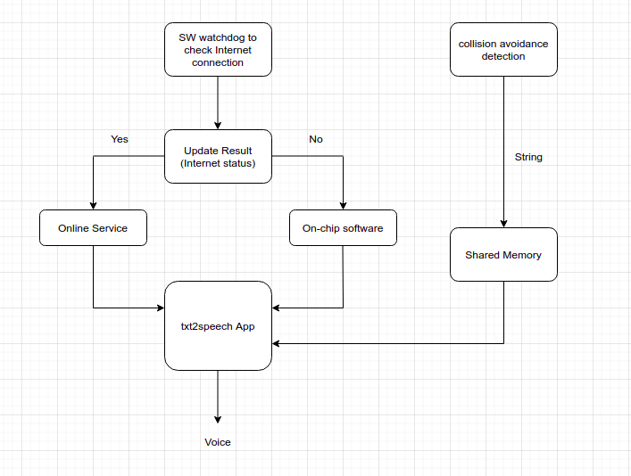
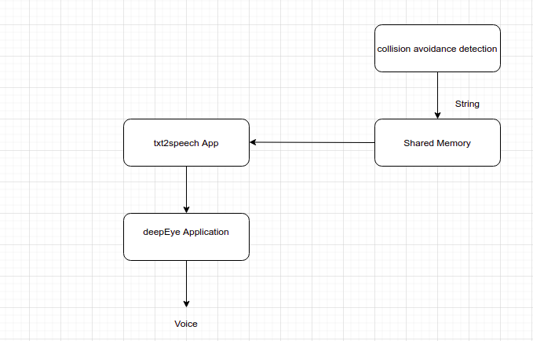

# Text to speech support for deepEye

## Introduction
This software component is to detect the moving objects like <b>bicycle, car, bus, dog, horse, motorbike</b> towards the camera, and alert them through speaker/headphone if there is a possible collision.

We plan to support this feature both edge device and mobile app conversion. For example, if the user connected deepEye device via BT then send the text to the mobile app directly and convert them if not the conversion happens on edge devices.

## Software block
### On Device conversion block:



### Mobile Device conversion



### Dep
```bash
# google speech
sudo apt-get install sox libsox-fmt-mp3

python3 -m pip install pip install google-speech sox


# Mycroft Mimic V1
git clone https://github.com/MycroftAI/mimic1.git
cd mimic1
./dependencies.sh --prefix="/usr/local"
./autogen.sh
./configure --prefix="/usr/local"
make
make check
```